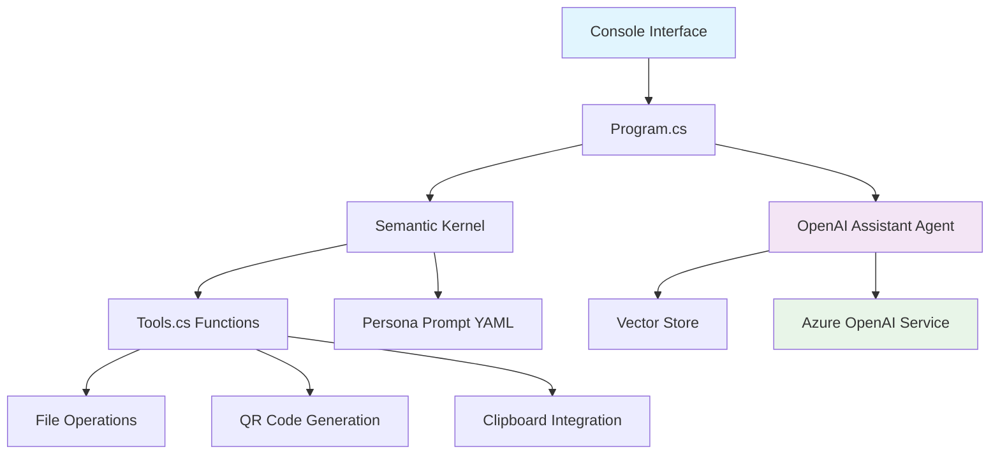
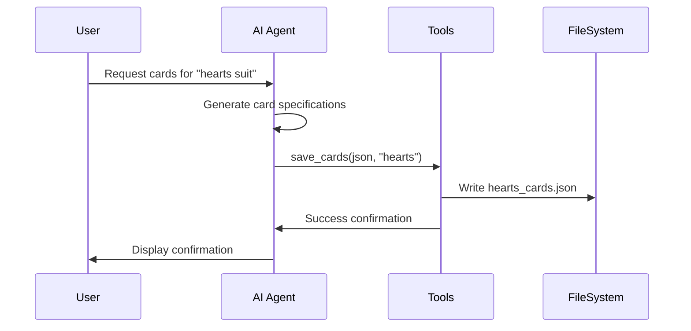

# 📊 Project Overview

CardMaker is a sophisticated AI-powered console application designed to generate Platform Engineering themed trading cards. This document provides an architectural overview and explains the project's design philosophy.

## 🏗️ Architecture Overview



## 🎯 Design Philosophy

### Minimalist CLI Tool (M-CLI)
CardMaker follows the **Model Command Line Interface** pattern:
- **Private 1:1 communication** with AI models
- **Local file access** and saving capabilities  
- **Clipboard integration** for seamless workflow
- **Console-optimized output** with Unicode formatting
- **Minimal dependencies** for efficiency

### Platform Engineering Focus
The application specifically targets **Platform Engineering** concepts:
- Tools and technologies used by platform teams
- Roles and responsibilities in platform engineering
- Real-world scenarios and use cases
- Educational content through card format

## 🧩 Core Components

### 1. Program.cs - Application Entry Point
```csharp
// Main orchestration:
// - Loads embedded resources (prompts, tools)
// - Configures Azure OpenAI connection
// - Sets up vector store for knowledge base
// - Initializes Semantic Kernel with tools
// - Manages interactive chat loop
```

**Key Features:**
- UTF-8 console encoding for Unicode support
- Vector store creation for enhanced AI context
- Semantic Kernel plugin system integration
- Graceful cleanup of Azure resources

### 2. Settings.cs - Configuration Management
```csharp
public class AzureOpenAISettings
{
    public string ChatModelDeployment { get; set; }
    public string Endpoint { get; set; }
    public string ApiKey { get; set; }
}
```

**Features:**
- Environment variable support
- User secrets integration
- Type-safe configuration binding
- Support for multiple AI providers

### 3. Tools.cs - AI Function Library
The heart of CardMaker's functionality:

| Function | Purpose | Return Type |
|----------|---------|-------------|
| `save_cards` | Save JSON card specifications | Success message |
| `copy_to_clipboard` | Copy text to system clipboard | Confirmation |
| `load_cards` | Load existing card files | JSON content |
| `create_qr_code` | Generate QR codes for documentation | File path |

### 4. ContextUtils.cs - Utility Functions
```csharp
// Embedded resource loading
// Console formatting helpers  
// OpenTelemetry logging setup
// Chat message streaming
```

## 📁 Resource Files

### Agent_Prompt_v2.md
Comprehensive grounding document covering:
- Platform Engineering key concepts
- Role definitions and responsibilities  
- Tools and technologies by domain
- Industry best practices

### Persona_Prompt.yaml
YAML-based prompt template featuring:
- Gandalf-inspired quote generation
- Platform Engineering knowledge integration
- Semantic Kernel template format
- Dynamic variable substitution

### Tools.txt
Detailed tool catalog including:
- Tool descriptions and purposes
- Associated image assets
- Role-based categorization
- Support for different engineering disciplines

## 🎴 Card Generation Process



## 🔧 Technology Stack

### Core Framework
- **.NET 9.0** (Windows targeted)
- **C# 12** with nullable reference types
- **Microsoft.SemanticKernel** for AI orchestration

### AI & Machine Learning
- **Azure OpenAI** for chat completion
- **OpenAI Assistants API** for enhanced capabilities
- **Vector stores** for knowledge augmentation

### Utility Libraries
- **QRCoder** for QR code generation
- **TextCopy** for clipboard operations
- **ConsoleTextFormat** for terminal styling
- **System.Drawing.Common** for image processing

### Configuration & Logging
- **Microsoft.Extensions.Configuration** 
- **User Secrets** for secure API key storage
- **OpenTelemetry** for observability

## 🎨 Output Format

CardMaker generates JSON specifications optimized for:
- **Adobe Illustrator data merge** workflows
- **Print production** requirements
- **Asset management** systems
- **Version control** friendly formatting

Example card structure:
```json
{
  "card_id": 1,
  "suit": "hearts",
  "rank": "Ace", 
  "role": "Platform Engineer",
  "tool": "Azure Kubernetes Service",
  "description": "Managed Kubernetes clusters...",
  "quote": "Gandalf-inspired wisdom...",
  "image": "AKS-Automatic-Icon.png",
  "qr_code": "1.png"
}
```

## 🌟 Extensibility

### Adding New Tools
1. Add methods to `Tools.cs` with `[KernelFunction]` attribute
2. Include `[Description]` for AI understanding
3. Update `Tools.txt` resource file

### Customizing Personas
1. Modify `Persona_Prompt.yaml` template
2. Adjust temperature and TopP settings
3. Add new input variables as needed

### Expanding Knowledge Base
1. Add new embedded resources
2. Update agent prompt documents
3. Include additional vector store files

Ready to dive deeper? Check out the [**Tools Reference**](tools-reference.md) for detailed function documentation! 🔧